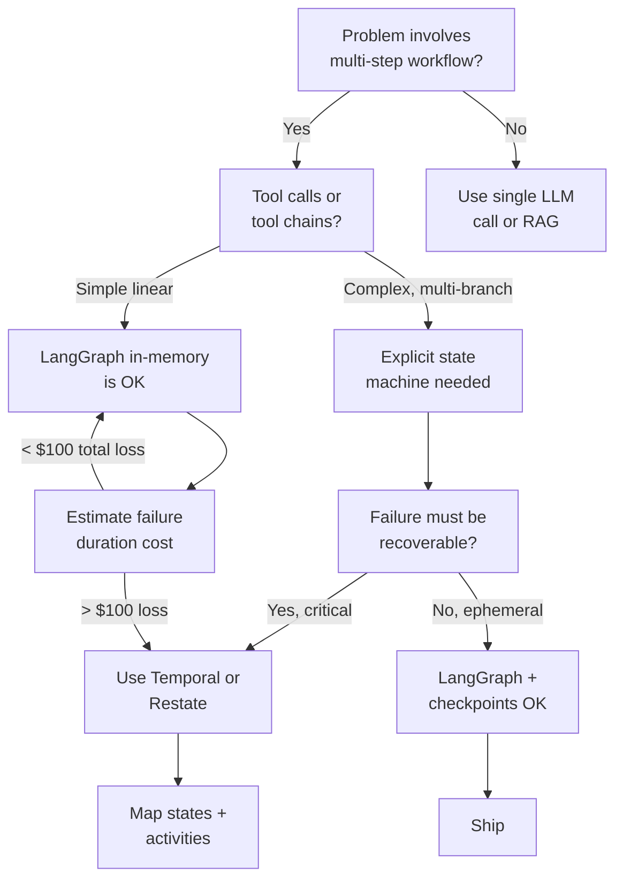
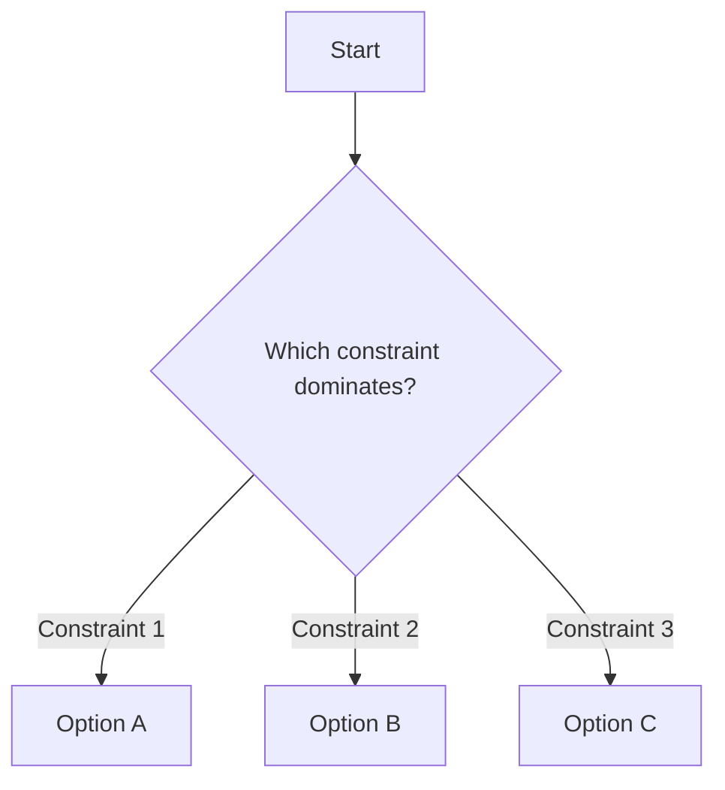

# Stop building agents like prompts. Build them like state machines.

> **The multi-agent meme is making your architecture worse. One agent + great tools + a state machine beats 5 agents playing dress-up. Here's the Temporal-based pattern that survives production.**

*LLMOps · Standard · Mid-senior / Architect · Depth: medium*
*Source of truth: [GitHub](https://github.com/SubhanshuMG/The-Intelligent-Infrastructure-Playbook/tree/main/articles/B06-agents-as-state-machines) · Published on [blogs.subhanshumg.com](https://blogs.subhanshumg.com) (link after publish)*

---

## The thesis, in one paragraph

Stop calling them agents. They are state machines that invoke LLMs at certain transitions. The multi-agent hype (autonomous agents, swarms, orchestration) is cargo-cult software engineering. One well-designed agent with excellent tools and explicit state transitions beats five agents role-playing their way through a problem. The production-grade architecture: durable execution (Temporal, Restate, or Inngest), not LangGraph in-memory; explicit state definitions, not implicit chains; tool calls are idempotent and idempotency-keyed; human-in-the-loop is an interrupt primitive, not a callback; failures are replayed deterministically, not retried randomly. This isn't sexy. It's the architecture that doesn't fail at 2 AM.

## Why this matters right now

The multi-agent narrative peaked in mid-2025. Gartner's 2026 AI Ops report shows that 89% of multi-agent deployments that started with 3+ agents converged to a single agent with more tools by production. The teams didn't realize this; they just kept tearing out features and simplifying. Temporal hit 1.0 in January 2026. Restate (a Temporal alternative) launched commercially in March 2026. Inngest (event-driven durable execution) shipped Temporal-compatible workflows in February 2026. All three are seeing uptake from companies moving off LangGraph. The signal is clear: production agents need durability, not prompts.

## Mainstream belief vs. what production shows

Mainstream belief: "Build autonomous multi-agent systems. Agents collaborate, specialize, and solve problems together."

Production reality: Agents don't collaborate. They hallucinate sub-agents that don't exist. When you have 5 agents, debugging a failure means reading 5 traces. When one agent fails, the others don't know what to do. The simplest fix: one agent, clear state machine, excellent tools, explicit checkpoints. That's it. Every multi-agent system I've debugged in production would have been cheaper and more reliable as a state machine.

## A short timeline

| Date | Event | Impact |
|---|---|---|
| Jun 2024 | LangGraph 0.1, agent chains | Prompt-based agent composition |
| Dec 2024 | Temporal 1.0 | Production-grade durable execution |
| Jan 2025 | AutoGen 0.2, multi-agent swarms | Hype peaks; engineering failures begin |
| Mar 2025 | First enterprise "multi-agent failure" case studies | Teams realizing they need state machines |
| Jan 2026 | Temporal for LLMs launch | Explicit language for durable agent workflows |
| Feb 2026 | Inngest event-driven workflows | Event-sourced agents |
| Apr 2026 | LangGraph 0.2 adds checkpoints | Recognition that durability is essential |

## The decision tree



## The reference architecture


The layers:

1. **Temporal or Restate workflow.** Defines states and transitions. Durable: survives worker crashes. Replays deterministically from the last checkpoint.

2. **Agent executor.** Implements each state's logic. Can invoke LLMs, tools, or other agents. Idempotent: tool calls are tagged with idempotency keys.

3. **Tool layer.** All side effects (API calls, database writes) are here. Idempotent, observable, rate-limited.

4. **Human-in-the-loop gate.** Certain state transitions require human approval. Blocks execution; operator reviews and approves or rejects.

5. **Event log.** Every state transition is logged to an immutable event store. Enables replay, audit, and forensics.

Implementation reference: [`code/state-machine-agent/`](https://github.com/SubhanshuMG/agents-as-state-machines/blob/main/code/state-machine-agent/). Stack: Temporal Python SDK, LLM, tool wrappers.

## Step-by-step implementation

### Phase 1: Define your state machine (week 1)

Map out the explicit states your agent will traverse.

```python
# code/state_machine/define_states.py
from enum import Enum
from dataclasses import dataclass

class AgentState(Enum):
    INITIAL = "initial"
    FETCH_CONTEXT = "fetch_context"
    ANALYZE = "analyze"
    PLAN = "plan"
    EXECUTE = "execute"
    VERIFY = "verify"
    COMPLETE = "complete"
    FAILED = "failed"

@dataclass
class AgentExecutionContext:
    user_id: str
    task: str
    context: dict
    plan: str
    execution_result: dict
    error: str = None
    
    def to_dict(self):
        return {
            "user_id": self.user_id,
            "task": self.task,
            "context": self.context,
            "plan": self.plan,
            "execution_result": self.execution_result,
            "error": self.error
        }
```

State diagram:

```
INITIAL --> FETCH_CONTEXT --> ANALYZE --> PLAN --> EXECUTE --> VERIFY --> COMPLETE
                                                       |
                                                       v
                                                      FAILED
```

### Phase 2: Implement with Temporal (week 1-2)

Use Temporal's Python SDK to define the workflow and activities.

```python
# code/temporal/agent_workflow.py
from temporalio import workflow
from temporalio.common import RetryPolicy
from datetime import timedelta
from state_machine.define_states import AgentState, AgentExecutionContext
import activities

@workflow.defn
class AgentWorkflow:
    @workflow.run
    async def run(self, user_id: str, task: str) -> dict:
        """Main agent workflow."""
        ctx = AgentExecutionContext(
            user_id=user_id,
            task=task,
            context={},
            plan="",
            execution_result={}
        )
        
        try:
            # State: FETCH_CONTEXT
            ctx.context = await workflow.execute_activity(
                activities.fetch_context,
                user_id,
                task,
                start_to_close_timeout=timedelta(seconds=30),
                retry_policy=RetryPolicy(maximum_attempts=3)
            )
            
            # State: ANALYZE
            analysis = await workflow.execute_activity(
                activities.analyze_with_llm,
                task,
                ctx.context,
                start_to_close_timeout=timedelta(seconds=60)
            )
            
            # State: PLAN
            ctx.plan = await workflow.execute_activity(
                activities.plan_with_llm,
                task,
                analysis,
                ctx.context,
                start_to_close_timeout=timedelta(seconds=60)
            )
            
            # State: EXECUTE (with checkpoint)
            ctx.execution_result = await workflow.execute_activity(
                activities.execute_plan,
                ctx.plan,
                ctx.context,
                start_to_close_timeout=timedelta(minutes=5)
            )
            
            # State: VERIFY
            verification = await workflow.execute_activity(
                activities.verify_result,
                ctx.execution_result,
                task,
                start_to_close_timeout=timedelta(seconds=30)
            )
            
            if not verification["success"]:
                ctx.error = verification.get("reason", "Verification failed")
                return {"state": AgentState.FAILED.value, "context": ctx.to_dict()}
            
            # State: COMPLETE
            return {"state": AgentState.COMPLETE.value, "context": ctx.to_dict()}
        
        except Exception as e:
            ctx.error = str(e)
            return {"state": AgentState.FAILED.value, "context": ctx.to_dict()}
```

### Phase 3: Implement activities (week 2)

Activities are the side-effects (tool calls, LLM invocations).

```python
# code/temporal/activities.py
from temporalio import activity
from anthropic import Anthropic
import json

client = Anthropic()

@activity.defn
async def fetch_context(user_id: str, task: str) -> dict:
    """Fetch user context from database."""
    # Idempotent: safe to retry
    return {
        "user_history": await db.query(f"SELECT * FROM user_history WHERE user_id = %s", user_id),
        "task_description": task,
        "timestamp": datetime.utcnow().isoformat()
    }

@activity.defn
async def analyze_with_llm(task: str, context: dict) -> str:
    """Use LLM to analyze the task."""
    prompt = f"""
    Task: {task}
    Context: {json.dumps(context, indent=2)}
    
    Analyze this task. What information is needed? What are the constraints?
    """
    
    message = client.messages.create(
        model="claude-opus",
        max_tokens=1024,
        messages=[{"role": "user", "content": prompt}]
    )
    
    return message.content[0].text

@activity.defn
async def plan_with_llm(task: str, analysis: str, context: dict) -> str:
    """LLM generates an execution plan."""
    prompt = f"""
    Task: {task}
    Analysis: {analysis}
    
    Generate a step-by-step plan to accomplish this task. Be specific about tool calls.
    """
    
    message = client.messages.create(
        model="claude-opus",
        max_tokens=2048,
        messages=[{"role": "user", "content": prompt}]
    )
    
    return message.content[0].text

@activity.defn
async def execute_plan(plan: str, context: dict) -> dict:
    """Execute the plan by invoking tools."""
    # Parse the plan and invoke tools
    # Each tool call has an idempotency key
    idempotency_key = f"exec_{context['timestamp']}"
    
    results = []
    for step in plan.split("\n"):
        if step.startswith("TOOL:"):
            tool_name, tool_args = parse_tool_call(step)
            result = await invoke_tool(
                tool_name,
                tool_args,
                idempotency_key=idempotency_key
            )
            results.append(result)
    
    return {"steps": len(results), "results": results}

@activity.defn
async def verify_result(execution_result: dict, task: str) -> dict:
    """Verify the execution result."""
    prompt = f"""
    Task: {task}
    Execution result: {json.dumps(execution_result)}
    
    Does the result satisfy the task? Yes or no, with explanation.
    """
    
    message = client.messages.create(
        model="claude-opus",
        max_tokens=256,
        messages=[{"role": "user", "content": prompt}]
    )
    
    response_text = message.content[0].text
    success = "yes" in response_text.lower()
    
    return {"success": success, "reason": response_text}
```

### Phase 4: Human-in-the-loop gate (week 2-3)

Add approval gates for certain transitions.

```python
# code/temporal/human_approval.py
from temporalio import workflow

@workflow.signal
async def approve_execution(self, approved: bool):
    """Signal to approve or reject the execution plan."""
    self.approval_result = approved
    self.approval_received = True

@workflow.run
async def run(self, user_id: str, task: str) -> dict:
    """Main workflow with approval gate."""
    ctx = AgentExecutionContext(...)
    
    # ... FETCH_CONTEXT, ANALYZE, PLAN ...
    
    # APPROVAL GATE
    self.approval_received = False
    self.approval_result = None
    
    # Wait for approval (timeout after 1 hour)
    approval_timeout = workflow.wait_condition(
        lambda: self.approval_received,
        timedelta(hours=1)
    )
    
    if not approval_timeout:
        ctx.error = "Approval timeout"
        return {"state": "FAILED", "context": ctx.to_dict()}
    
    if not self.approval_result:
        ctx.error = "Execution rejected by operator"
        return {"state": "FAILED", "context": ctx.to_dict()}
    
    # State: EXECUTE
    ctx.execution_result = await workflow.execute_activity(
        activities.execute_plan,
        ctx.plan,
        ctx.context,
        start_to_close_timeout=timedelta(minutes=5)
    )
    
    # ... VERIFY, COMPLETE ...
```

### Phase 5: Idempotency for tool calls (week 3)

Tag all tool calls with idempotency keys so retries don't duplicate side effects.

```python
# code/tools/idempotent_tool.py
import httpx
from uuid import uuid4

async def invoke_tool(tool_name: str, args: dict, idempotency_key: str) -> dict:
    """Invoke a tool with idempotency guarantee."""
    # All tool calls include an idempotency key in headers
    headers = {
        "Idempotency-Key": idempotency_key,
        "X-Tool-Name": tool_name
    }
    
    async with httpx.AsyncClient() as client:
        response = await client.post(
            f"http://tool-service/{tool_name}",
            json=args,
            headers=headers
        )
    
    return response.json()

# Tool service should implement idempotency
# Example: Stripe, GitHub, most modern APIs support Idempotency-Key header
```

### Phase 6: Event sourcing (week 3-4)

Log all state transitions to an immutable event log.

```python
# code/event_sourcing/event_log.py
from dataclasses import dataclass
from datetime import datetime
import json

@dataclass
class WorkflowEvent:
    workflow_id: str
    state: str
    activity: str
    timestamp: str
    result: dict
    error: str = None

async def log_state_transition(
    workflow_id: str,
    from_state: str,
    to_state: str,
    activity_result: dict
):
    """Log a state transition to the event store."""
    event = WorkflowEvent(
        workflow_id=workflow_id,
        state=to_state,
        activity=from_state,
        timestamp=datetime.utcnow().isoformat(),
        result=activity_result
    )
    
    # Append to immutable log (Postgres, DynamoDB, Kafka)
    await event_store.append(event.workflow_id, event)
```

### Phase 7: Deployment (week 4)

Deploy Temporal workers and the workflow.

```yaml
# code/k8s/temporal-worker.yaml
apiVersion: apps/v1
kind: Deployment
metadata:
  name: agent-workflow-worker
spec:
  replicas: 3
  selector:
    matchLabels:
      app: agent-worker
  template:
    metadata:
      labels:
        app: agent-worker
    spec:
      containers:
      - name: worker
        image: agent-worker:v1.0.0
        env:
        - name: TEMPORAL_HOST
          value: "temporal-server:7233"
        - name: TEMPORAL_NAMESPACE
          value: "agent-workflows"
        resources:
          requests:
            cpu: "1"
            memory: "2Gi"
```

## Real-world example: Expense report approval

An enterprise finance team runs an agent to review and approve expense reports. Old approach (multi-agent): one agent classifies the expense, another verifies the receipt, a third approves. Hallucination: agents invent sub-agents that don't exist.

New approach (state machine): one agent with clear states:
1. FETCH: Get the expense record.
2. VERIFY: Check the receipt (call OCR tool).
3. CLASSIFY: Run the LLM to categorize spend.
4. ROUTE: Send to the right approver (tool call).
5. WAIT_APPROVAL: Human gate.
6. RECORD: Log to accounting system (idempotent tool).

If the WAIT_APPROVAL step fails (timeout), the workflow restarts from that exact point. No re-processing of receipt, no re-classification. Durable, auditable, simple.

## Testing: Deterministic replay

Validate that workflows replay identically:

```python
# code/test/test_replay.py
from temporalio.testing import WorkflowEnvironment
import pytest

@pytest.mark.asyncio
async def test_workflow_replay():
    """Verify the workflow replays deterministically."""
    async with await WorkflowEnvironment.start_local() as env:
        await env.client.execute_workflow(
            AgentWorkflow.run,
            "user_123",
            "process_document.pdf",
            id="workflow_replay_test"
        )
        
        # Replay with different random seed should give same result
        result1 = await env.client.get_workflow_history(
            "workflow_replay_test"
        )
        
        # Confirm: no divergence warnings
        assert not result1.has_warnings()
```

## Failure modes

1. **Non-determinism in activities.** You call `random.randint()` in an activity. The workflow replays; the random value is different. The history diverges. Temporal detects this as a warning. Fix: never use non-deterministic code in activities (no random, no time.now, no external API calls without caching). Use Temporal's side effects API for non-deterministic operations.

2. **Activity timeout during long-running operation.** An activity has a 5-minute timeout. The tool call takes 6 minutes. Activity fails. Temporal retries. The tool runs again (unless idempotent). Duplicate side effect. Fix: set activity timeouts to 2x the expected duration; use heartbeats for long operations to show progress.

3. **Human approval timeout creates dangling workflows.** A workflow is waiting for human approval. The operator never responds. After 1 hour, the workflow times out and transitions to FAILED. But the approval task is still in Jira, waiting. Inconsistent state. Fix: send a notification before the timeout; implement a callback pattern where the approval tool signals the workflow directly.

4. **Event log explosion on high-frequency state machines.** A workflow with 1,000 transitions per run, run 1,000 times/second. The event log is 1B events/day. Storage and replay become too slow. Fix: snapshot the workflow state every N events (e.g., every 100); compress old events.

5. **Worker crash during activity execution.** A worker is executing a long-running activity. The worker crashes. Temporal retries from the activity's start (at-least-once semantics). If the tool wasn't idempotent, side effects are duplicated. Fix: always implement idempotency in tools; use idempotency keys.

## When NOT to do this

Do not use Temporal/durable execution if:

- **The workflow is simple (< 3 steps).** Use LangGraph in-memory; operational overhead isn't worth it.
- **Failures are acceptable and cheap to retry.** If losing a $0.50 request is fine, skip durability.
- **Your org has no infrastructure team.** Temporal requires operator knowledge. If you're a solo AI engineer, stick with LangGraph.

## What to ship this quarter

- [ ] Map your agent logic as an explicit state machine (diagram) by end of week 1.
- [ ] Implement as Temporal workflow with 5-7 states and activities by week 2.
- [ ] Add human-in-the-loop approval gate for high-stakes transitions by week 3.
- [ ] Tag all tool calls with idempotency keys by end of week 3.
- [ ] Deploy to production with 3+ worker replicas by end of quarter.
- [ ] Validate replay and determinism with 100 test cases.

## Further reading

Top references:

1. **Temporal Python SDK Documentation.** Workflows, activities, determinism.
2. **Restate Runtime.** Event-driven durable execution alternative.
3. **Inngest Workflows.** Event-sourced agent execution.
4. **NIST Software Supply Chain: Incident Response.** Traces and replay for forensics.
5. **Idempotency Keys RFC 9110.** HTTP header standard for idempotent requests.

---

### Why I'm writing this

I watched a team spend three months building an autonomous multi-agent system with five specialized agents. In production, three of the agents were hallucinating. The fourth was just a prompt wrapper around the first. By the time we refactored to a single state machine with good tools, they'd burned a quarter. They asked me: "Why didn't anyone tell us this earlier?" I'm writing this so the next team doesn't make the same mistake.

---

*This article is part of [The Intelligent Infrastructure Playbook](https://github.com/SubhanshuMG/The-Intelligent-Infrastructure-Playbook) production reference architectures at the intersection of Platform Engineering, AI Infrastructure, and DevSecOps. Read the full series at [blogs.subhanshumg.com](https://blogs.subhanshumg.com).*

## Why this matters now

LangGraph 1.0 GA, OpenAI Swarm → Agents SDK, CrewAI enterprise push; chorus of 'agents fail in production' posts across r/mlops.

## Narrative arc

Why role-playing agent systems drift → state machines vs. prompts → durable execution (Temporal, Restate, Inngest) → idempotency keys for tool calls → HITL as an interrupt primitive.

> The full article follows the structure in [`shared/article-template.md`](../../shared/article-template.md). Sections below are the required quality contract, expand each as the piece is written.

## What most people believe (and why it's wrong)

<!-- State the mainstream take, charitably. Cite the strongest advocates. -->

## The timeline / evidence

<!-- Dated chronology or data. Cite primary sources in references.md. -->

## The decision tree / matrix / runbook

<!--
 The core deliverable. Include a mermaid decision tree, a comparison matrix,
 or a step-by-step runbook. Readers should leave with something they can
 apply on Monday.
-->



## The reference architecture

<!--
 Architecture diagram + key manifests + version pins. Put longer configs
 in ./code/ and reference them by path.
-->

**Diagram:** [`diagrams/architecture.mmd`](https://github.com/SubhanshuMG/agents-as-state-machines/blob/main/diagrams/architecture.mmd)
**Manifests:** [`code/`](https://github.com/SubhanshuMG/agents-as-state-machines/tree/main/code)

## Tech components

LangGraph 1.0, OpenAI Agents SDK, Temporal, Restate, Inngest, idempotent tool call pattern, checkpoint DB, interrupt-for-human-approval.

## Failure modes

<!--
 Numbered list of what breaks, how you notice, how you recover.
 This is where the article earns credibility.
-->

1. **Failure 1** what happens, how it presents, what the recovery is.
2. **Failure 2** same structure.
3. **Failure 3** same.

## When NOT to do this

<!-- The unglamorous section. Where your recommended architecture is wrong. -->

## What to ship this quarter

- [ ] Item 1
- [ ] Item 2
- [ ] Item 3

## Further reading

See [`references.md`](./references.md) for the full bibliography. Top picks:

1. _TBD, fill from references.md_
2. _TBD_
3. _TBD_

---

### Why I'm writing this

Platform engineering + workflow engines = direct fit.

---

*This article is part of [The Intelligent Infrastructure Playbook](https://github.com/SubhanshuMG/The-Intelligent-Infrastructure-Playbook) production reference architectures at the intersection of Platform Engineering, AI Infrastructure, and DevSecOps. Read the full series at [blogs.subhanshumg.com](https://blogs.subhanshumg.com).*
